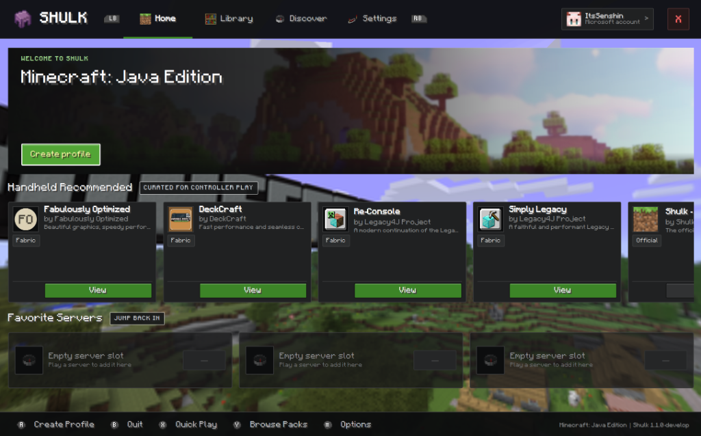
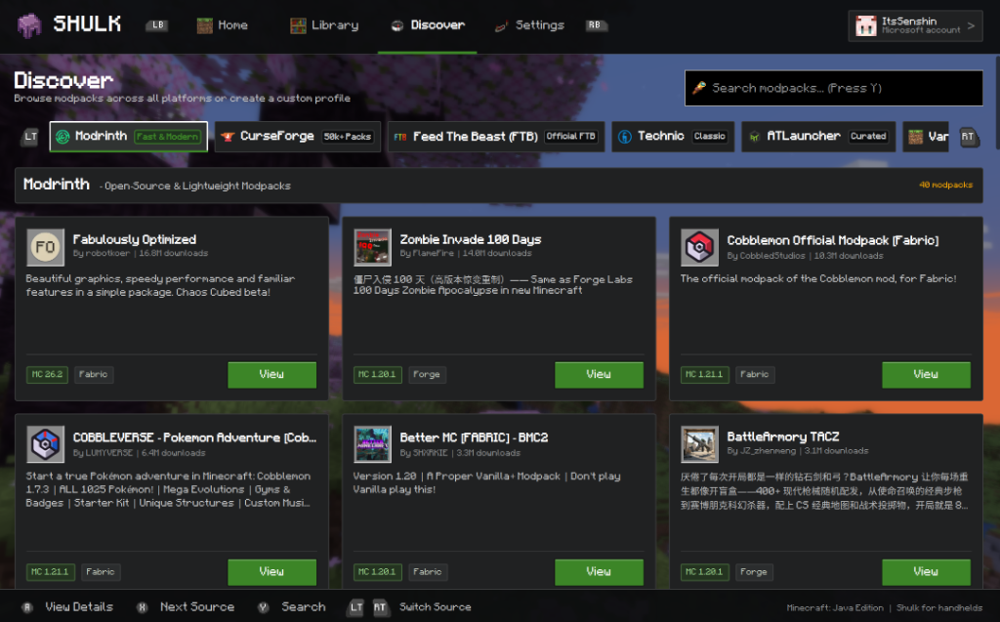

# Shulk

A controller-first Minecraft launcher for handheld PCs like the Steam Deck, ROG Ally, and Legion Go.

<p align="center">
  
</p>

## Why I made this

Playing Java Edition on handhelds is awesome, but the launchers aren't. Navigating desktop menus with a touchscreen or thumbstick trackpad cursor gets frustrating fast. 

Shulk is built from the ground up for a controller. It uses Prism Launcher's engine under the hood for modpack downloading and instance management, but swaps the desktop UI for a clean, console-style interface that you can control completely with a gamepad.

<p align="center">
  
</p>

## Highlights

- **Built for controllers**: Full gamepad navigation from start to finish. Move with your D-pad or sticks, jump between main menus with LB/RB, flip modpack sources with LT/RT, and press Y anywhere to bring up the on-screen keyboard. Supports Xbox, Steam Deck, PlayStation, and Switch button glyphs.
- **Search and download modpacks**: Browse Modrinth, CurseForge, FTB, Technic, and ATLauncher directly from your couch. You can view mod lists, read descriptions, check screenshots, and install packs in one click.
- **"Official" Minecraft feel**: 3D rotating panoramic backgrounds from official update screens (with a random shuffle on startup), authentic UI sound effects, and clean Minecraft fonts.
- **Made for handheld screens**: Sized and spaced for 7" to 8" displays at 800p and 1080p so you don't have to squint.
- **Battery conscious**: Pauses background 3D shaders and dials back controller polling whenever you minimize or launch into the game so it doesn't waste your battery.
- **Standard Java Edition**: Signs in with your Microsoft account via device code, supports Fabric, Forge, NeoForge, and Quilt, and works with all Minecraft versions.

## Download & Install

Grab the latest build from the [Releases](https://github.com/NaiSenshin/Shulk/releases) page:

- **Linux / Steam Deck / Bazzite**: Download `Shulk-v1.0.0-Linux-Installer.tar.gz`. Extract it, double-click `Install Shulk`, and you're good to go. It automatically adds Shulk to your App Menu and Steam's Non-Steam Game list.
- **Windows**: Download `Shulk-v1.0.0-Windows-x64.zip`, unzip it anywhere, and launch `shulk.exe`.

## Building from source

If you want to compile it yourself:

```bash
git clone https://github.com/NaiSenshin/Shulk.git
cd Shulk

cmake -B build -G Ninja -DCMAKE_BUILD_TYPE=Release
cmake --build build --target prismlauncher -j$(nproc)

./build/prismlauncher
```

Dependencies: C++23 compiler, CMake 3.22+, Ninja, Qt 6.8+ (Core, Gui, Quick, Qml, QuickControls2, Network, Svg), SDL2, and zlib.

## Credits & License

Shulk is open source under [GPL-3.0](LICENSE).

Big thanks to the **Prism Launcher** and **MultiMC** projects. Shulk relies on their launch code and platform APIs.

*Not an official Minecraft product. Not approved by or associated with Mojang or Microsoft.*
