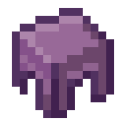

# Shulk

<p align="center">
  
  <br />
  <b>A controller-first Minecraft Java launcher crafted for handheld gaming PCs.</b>
  <br />
  <sub>Steam Deck • ROG Ally • Legion Go • SteamOS • Bazzite • Windows Handhelds • Living Room PCs</sub>
</p>

---

## Why Shulk?

Playing Java Edition Minecraft on a portable handheld like the Steam Deck or ROG Ally is fantastic. But trying to manage your instances, search for modpacks, or organize mods with a tiny touch screen or clunky trackpad mouse emulation usually isn't.

**Shulk** was built to solve that. Built on top of the rock-solid Prism Launcher C++ backend, Shulk replaces the traditional desktop interface with a fluid, gamepad-driven experience that feels right at home on a console.

---

## What makes it special?

* **Pick up and play**: Full 2D gamepad navigation out of the box. Use your analog stick or D-pad to move around, bump through main menus with `LB` / `RB`, cycle through sub-tabs with `LT` / `RT`, and pop up the virtual keyboard automatically whenever you need to search. Supports Xbox, Steam Deck, PlayStation, and Switch button layouts.
* **Modpacks from anywhere**: Browse and search Modrinth, CurseForge, Feed The Beast, Technic, and ATLauncher directly from the couch. View included mods, inspect screenshot galleries, and install in a single click.
* **That classic Minecraft feel**: Features real 3D rotating panoramic skyboxes from Mojang's iconic title screens (with random shuffle on launch!), official click and chest sounds, and crisp Minecraft typography.
* **Handheld & battery friendly**: Large, legible fonts and buttons designed for 7" to 8" screens (800p / 1080p). It also automatically pauses 3D shaders and slows polling when you're tabbed out or in-game so your battery lasts longer.
* **Full Java Edition power**: Seamless Microsoft device-code login, instant loader setup (Fabric, NeoForge, Forge, Quilt), and support for every release from early Alpha to the latest snapshots.

---

## Getting Started

You can download ready-to-run portable packages directly from the [Releases](https://github.com/NaiSenshin/Shulk/releases) tab:

* **Steam Deck / Linux**: Download `Shulk-v1.0.0-Linux-x86_64.tar.gz`, extract it to your preferred folder, and run `./shulk`. (You can also easily add it as a Non-Steam Game in Steam Desktop Mode).
* **Windows Handhelds**: Download `Shulk-v1.0.0-Windows-x64.zip`, extract, and launch `shulk.exe`.

Because it runs in portable mode, all your settings and instances stay self-contained inside the folder without touching the rest of your system.

---

## Building from Source

If you prefer building it yourself:

### Requirements
* CMake 3.22+
* Ninja or Make
* C++23 capable compiler (GCC 13+, Clang 17+, MSVC 2022)
* Qt 6.8+ (Core, Gui, Widgets, Quick, Qml, QuickControls2, Network, OpenGL, Svg)
* SDL2 & zlib

### Quick Build (Linux)
```bash
git clone https://github.com/NaiSenshin/Shulk.git
cd Shulk

cmake -B build -G Ninja -DCMAKE_BUILD_TYPE=Release
cmake --build build --target prismlauncher -j$(nproc)

./build/prismlauncher
```

---

## Credits & License

Shulk is open-source software licensed under the **GNU General Public License v3.0 (GPL-3.0)**. See the [LICENSE](LICENSE) file for full details.

A massive thank you to the **Prism Launcher** and **MultiMC** teams and contributors — Shulk relies heavily on their mature launch core, instance management, and platform integrations.

*Minecraft is a trademark of Mojang Synergies AB. Shulk is an independent community project and is not affiliated with Mojang or Microsoft.*
